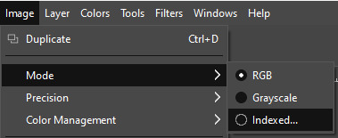
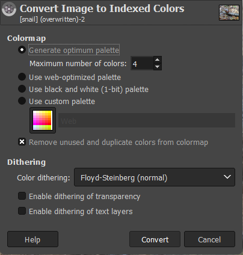
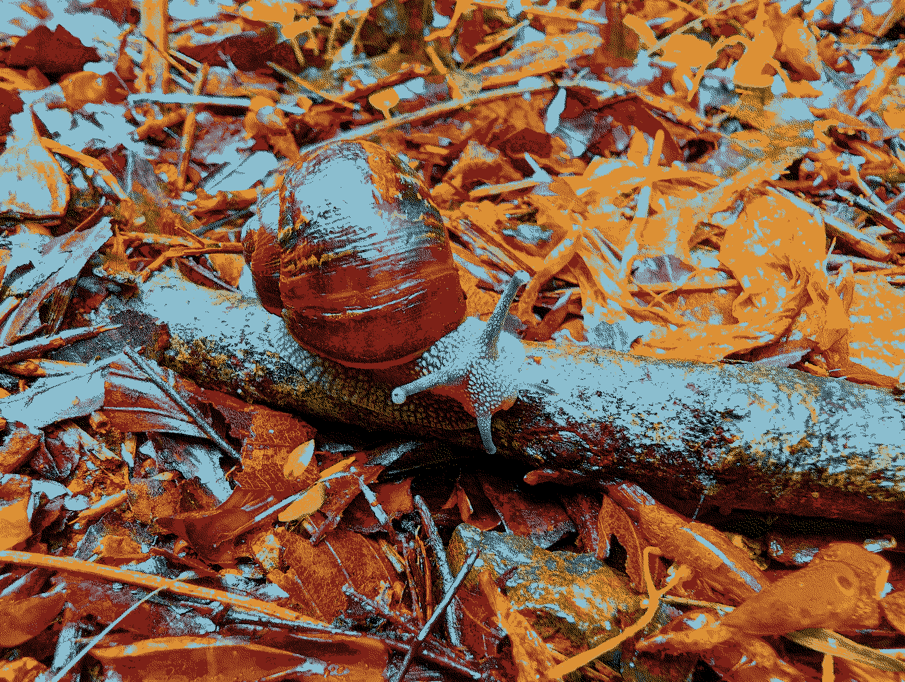
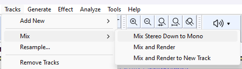
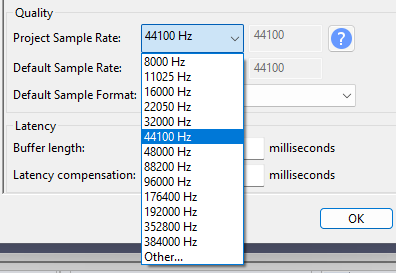
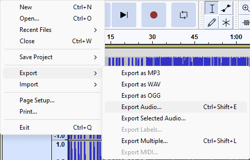
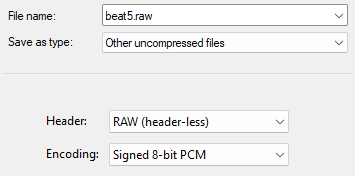
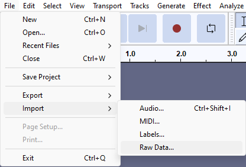
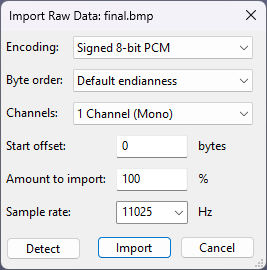
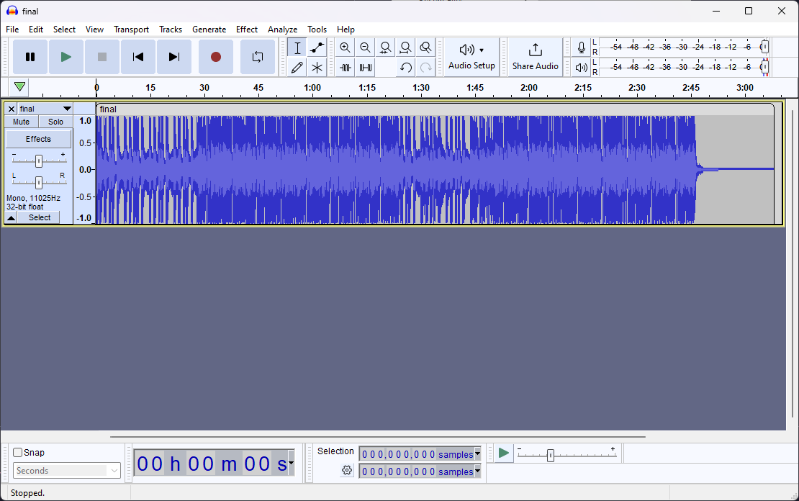

# audiovisual supercollider

merge an image with an audio stream to produce a valid bitmap that can also be played as (slightly noisy) audio.

method based on [this article](https://www.databending.org/experiment4.html)

the name is an overt nod to the awesome [supercollider](https://supercollider.github.io)

## installation

install from source:

```console
cargo install --git https://github.com/backwardspy/audiovisual-supercollider
```

or build & run locally:

```console
$ git clone https://github.com/backwardspy/audiovisual-supercollider
$ cd audiovisual-supercollider
$ cargo run --release
```

## usage

```
Usage: audiovisual-supercollider <IMAGE_PATH> <AUDIO_PATH>

Arguments:
  <IMAGE_PATH>
  <AUDIO_PATH>

Options:
  -h, --help  Print help
```

## guide

### inputs

first we need a piece of audio and an image large enough to squash it into.

i'll use [lil beat #5](https://www.cc0music.wtf) and [this picture i took of a snail](data/snail.jpeg)

some guidelines:
- the picture shouldn't be *too* big. it will be converted into an 8bpp indexed bitmap, aka no compression. this 1660x1250 snail picture will end up as a 1.98 MB bitmap.
- bitmaps are padded to maintain multiple-of-four row width. to avoid me dealing with that, i require the input image width % 4 == 0. if you get it wrong, don't worry, the program will tell you how many columns to shave off.

### image preparation

first, the picture needs to be crushed down to just four colours. there are endless ways to do this, but one easy way is clicking these buttons in [GIMP](https://www.gimp.org/):





with a bit more care you can probably make something that looks half-decent. this is what i'll use:

<details>
<summary>expand image</summary>



</details>

> [!IMPORTANT]
> be sure to save your image in a lossless format such as PNG. this will ensure no additional colours can sneak in and ruin your hard work.

### audio preparation

with that done, it's time to massacre your audio file in much the same way. our ultimate goal here is a headerless 8-bit PCM file that fits within the size of our prepared image file.

i'll be using [audacity](https://www.audacityteam.org/) to achieve this.

if i export my audio file in the correct format without doing anything to minify it, i end up with ~7.25 MB of data to squash into my image. i can verify that this is too large by executing the program:

```console
$ audiovisual-supercollider data/snail.png data/beat5.raw
Error: 
   0: audio file is too large (7604352 bytes). ensure audio has no more than 2075000 samples/bytes

Location:
   src\main.rs:79
```

first, mix the track down from stereo to mono if necessary:



after that, the easiest way to slim the file down is by reducing the sample rate.

in audacity, go to Edit > Preferences (Ctrl/Cmd + P) and change "Project Sample Rate" to something smaller.



after changing the sample rate to a lower setting, export the audio as shown:





> [!IMPORTANT]
> be sure to remember the sample rate you picked. you'll need it to play the audio back again later!

in my case, 11,025 Hz was low enough to fit.

once you have found a sample rate that gets you within the maximum byte size, go ahead and run the program again:

```console
$ audiovisual-supercollider data/snail.png data/beat5.raw
done! check output/final.bmp
```

as the message implies, your finished product should now be in the `output/` directory.
you will also see the four colour masks used in the mixing process.

### final result

if all went well, `final.bmp` should look no different from the original 4-colour input image.
however, as promised, if you load `final.bmp` into audacity using the same format and sample rate you used for the raw audio track...





you should be able to play it back!



> [!NOTE]
> you will hear a quick "beep" sound at the beginning of the audio. this is the bitmap file header!